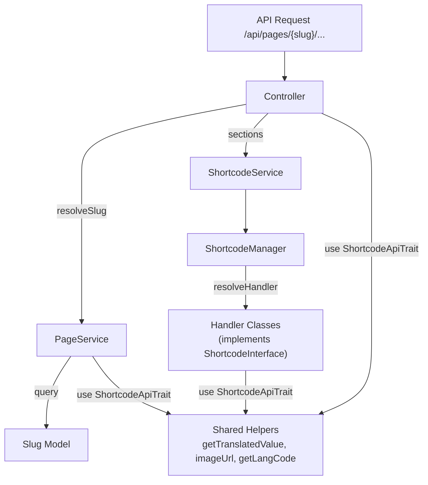

# Walkthrough: Code Architecture Clean Up

## Tổng quan

Refactored 7 files để follow **1 pattern thống nhất** cho logic, data fetching, và cấu trúc code.

## Pattern thống nhất



## Thay đổi

### Service Layer

| File | Thay đổi |
|---|---|
| [PageService.php](file:///d:/Duong/src/laragon/www/hst/admin/app/Services/PageService.php) | Thêm [resolveSlug()](file:///d:/Duong/src/laragon/www/hst/admin/app/Services/PageService.php#13-20), [resolvePageSlug()](file:///d:/Duong/src/laragon/www/hst/admin/app/Services/PageService.php#21-30). Dùng `ShortcodeApiTrait` thay vì duplicate methods |
| [ShortcodeService.php](file:///d:/Duong/src/laragon/www/hst/admin/app/Services/ShortcodeService.php) | Clean formatting, type hints |

### Shortcode Core

| File | Thay đổi |
|---|---|
| [ShortcodeManager.php](file:///d:/Duong/src/laragon/www/hst/admin/app/Shortcode/Core/ShortcodeManager.php) | Extracted [resolveHandler()](file:///d:/Duong/src/laragon/www/hst/admin/app/Shortcode/Core/ShortcodeManager.php#45-56), type hints, docblocks |
| [ShortcodeParser.php](file:///d:/Duong/src/laragon/www/hst/admin/app/Shortcode/Core/ShortcodeParser.php) | Clean formatting, docblocks |

### Handlers

| File | Thay đổi |
|---|---|
| [BlogPostsShortcode.php](file:///d:/Duong/src/laragon/www/hst/admin/app/Shortcode/Handlers/BlogPostsShortcode.php) | Xóa 30+ dòng duplicate ([getTranslatedValue](file:///d:/Duong/src/laragon/www/hst/admin/app/Http/Controllers/Api/Traits/ShortcodeApiTrait.php#337-362), [getLangCode](file:///d:/Duong/src/laragon/www/hst/admin/app/Http/Controllers/Api/Traits/ShortcodeApiTrait.php#363-377), [imageUrl](file:///d:/Duong/src/laragon/www/hst/admin/app/Http/Controllers/Api/Traits/ShortcodeApiTrait.php#382-389)). Dùng `ShortcodeApiTrait` |

### Controllers

| File | Thay đổi |
|---|---|
| [ShortcodeController.php](file:///d:/Duong/src/laragon/www/hst/admin/app/Http/Controllers/Api/Pages/ShortcodeController.php) | Dùng `PageService::resolveSlug()`, promoted constructor, xóa 10 unused imports |
| [PageDetailController.php](file:///d:/Duong/src/laragon/www/hst/admin/app/Http/Controllers/Api/Pages/PageDetailController.php) | Dùng `PageService::resolveSlug()` via DI, extracted [notFoundPayload()](file:///d:/Duong/src/laragon/www/hst/admin/app/Http/Controllers/Api/Pages/PageDetailController.php#188-197) + [buildSeo()](file:///d:/Duong/src/laragon/www/hst/admin/app/Http/Controllers/Api/Pages/PageDetailController.php#198-213) |

## Pattern mỗi Handler phải follow

```php
class XxxShortcode implements ShortcodeInterface
{
    use ShortcodeApiTrait;  // ← KHÔNG duplicate methods

    public static function shortcode(): string { return 'xxx'; }

    public function handle(array $attrs, string $locale): ?array
    {
        // 1. Parse attrs (IDs, limits...)
        // 2. Query model data
        // 3. Map → response array
        // 4. Return ['locale' => $locale, 'items' => [...]]
    }
}
```
